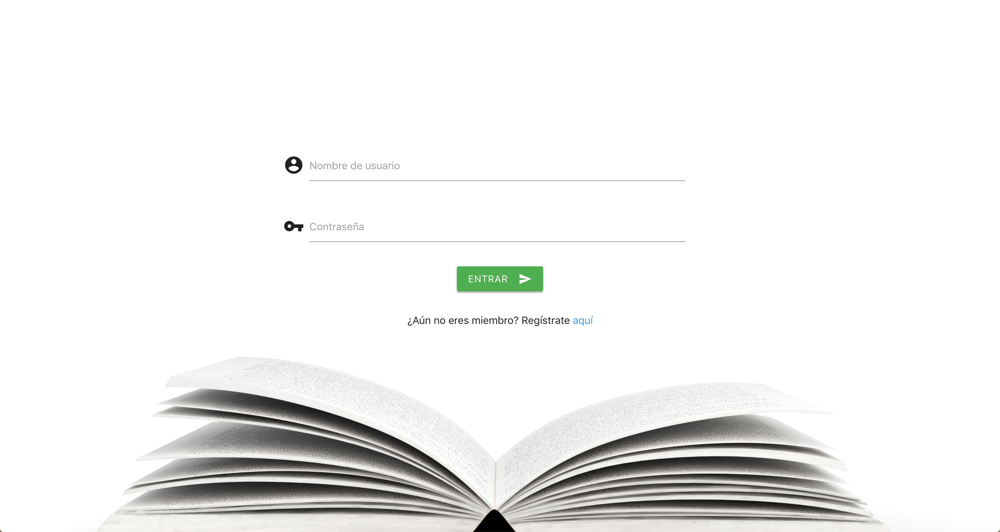

# Libroteca 
## Realizado por: Ángeleles Bueno Aguilar, 2º DAW IES Campanillas.

Aplicación web PHP para la consulta de libros previamente adquiridos de la API Google Books.
Pinchando en el logo se podrá volver al inicio

## Haz click <a href="http://libroteca.epizy.com" target="blank">aquí</a> para acceder a la aplicación.

